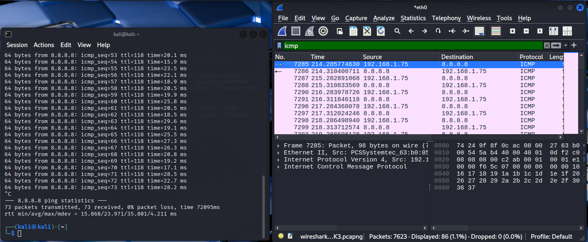
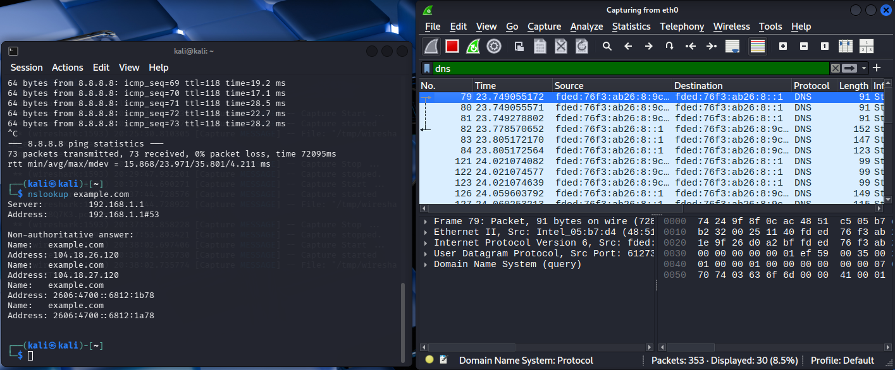
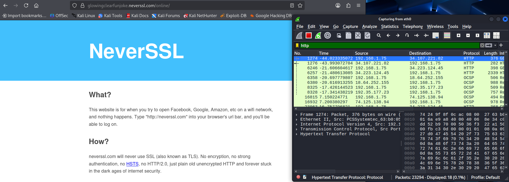

# Network Traffic Analysis Using Wireshark

## Objective
The objective of this project was to capture and analyze live network traffic using Wireshark in order to observe how common network protocols operate during real-time communication. Packet captures were performed to identify ICMP, DNS, and HTTP traffic generated during typical network activity such as host discovery, domain name resolution, and web browsing.

---

## Lab Environment
- Host Machine: Windows 11  
- Analysis Tool: Wireshark  
- Network Interface: eth0  
- Target Resources:
  - 8.8.8.8 (Google DNS Server)
  - example.com
  - neverssl.com  

---

## Tools Used
- Wireshark  
- Kali Linux Terminal  
- Ping Utility  
- nslookup  

---

## Steps Performed
1. Initiated a live packet capture using the active network interface.  
2. Generated ICMP traffic by sending echo requests to an external host (8.8.8.8).  
3. Generated DNS traffic by performing domain name lookups using nslookup.  
4. Generated HTTP traffic by accessing a non-encrypted website (neverssl.com).  
5. Applied protocol-specific display filters in Wireshark to isolate captured traffic.  
6. Analyzed packet details including source and destination addresses, protocols, and packet contents.  

---

## Key Findings
- ICMP packets confirmed successful host-to-host network connectivity.  
- DNS query and response packets revealed domain name resolution processes.  
- HTTP packets demonstrated how unencrypted web traffic is transmitted across a network.  
- Packet analysis showed protocol-specific header information including IP addressing and port usage.  
- Filtering network traffic improved visibility into specific protocol communication patterns.  

---

## Evidence

### 01-icmp-filter.png

---

### 02-dns-capture.png

---

### 03-http-filter.png

---

## Skills Demonstrated
- Network traffic capture and packet inspection  
- Protocol analysis (ICMP, DNS, HTTP)  
- Application of Wireshark display filters  
- Interpretation of packet-level communication  
- Identification of network behavior during live traffic capture  
